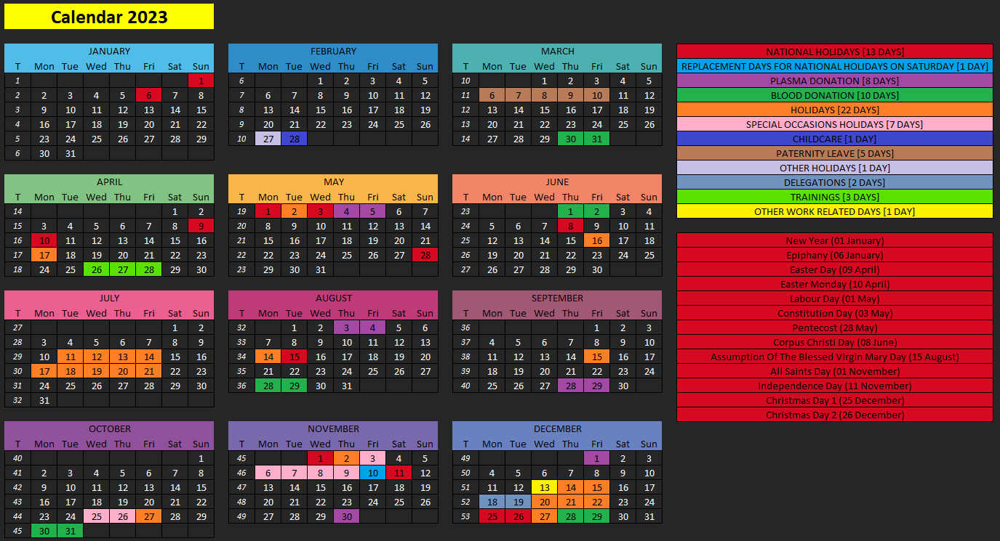

# calendar

# About The Project
Script creates an Excel file with your highlighted holidays, national holidays, special occasions holidays, blood/plasma donation, etc.

# Built with
### Python 3.12.2

# Getting started

1. Make sure you have Python 3.12 installed ([Python Release Python 3.12.2 | Python.org](https://www.python.org/downloads/release/python-3122/))
1. To install all required packages, type `pip install -r requirements.txt` in the terminal.
1. Construct file with name following the pattern `calendar_{YEAR}.json` with all proper holidays in a given year inside `input_files` directory.
1. Run script with `python main.py --year={YEAR} --theme=[ light | dark ]`. Theme parameter is optional. Default is `dark`.
1. Go to output_files directory and open the result (name is `calendar_{YEAR}.xlsx`).

## Example of `calendar_{YEAR}.json` content (you can use it as a template):
```json
{
  "NATIONAL HOLIDAYS ON SATURDAY REPLACEMENT DAYS": [
    {"single_day": {"month": 11, "day": 10}}
  ],
  "PLASMA DONATION": [
    {"start": {"month": 5, "day": 4}, "end": {"month": 5, "day": 5}},
    {"start": {"month": 8, "day": 3}, "end": {"month": 8, "day": 4}},
    {"start": {"month": 9, "day": 28}, "end": {"month": 9, "day": 29}},
    {"start": {"month": 11, "day": 30}, "end": {"month": 12, "day": 1}}
  ],
  "BLOOD DONATION": [
    {"start": {"month": 3, "day": 30}, "end": {"month": 3, "day": 31}},
    {"start": {"month": 6, "day": 1}, "end": {"month": 6, "day": 2}},
    {"start": {"month": 8, "day": 28}, "end": {"month": 8, "day": 29}},
    {"start": {"month": 10, "day": 30}, "end": {"month": 10, "day": 31}},
    {"start": {"month": 12, "day": 28}, "end": {"month": 12, "day": 29}}
  ],
  "HOLIDAYS": [
    {"single_day": {"month": 4, "day": 17}},
    {"single_day": {"month": 5, "day": 2}},
    {"single_day": {"month": 6, "day": 16}},
    {"start": {"month": 7, "day": 11}, "end": {"month": 7, "day": 21}},
    {"single_day": {"month": 8, "day": 14}},
    {"single_day": {"month": 9, "day": 15}},
    {"single_day": {"month": 10, "day": 27}},
    {"single_day": {"month": 11, "day": 2}},
    {"start": {"month": 12, "day": 14}, "end": {"month": 12, "day": 15}},
    {"start": {"month": 12, "day": 20}, "end": {"month": 12, "day": 27}}
  ],
  "SPECIAL OCCASIONS HOLIDAYS": [
    {"start": {"month": 10, "day": 25}, "end": {"month": 10, "day": 26}},
    {"start": {"month": 11, "day": 3}, "end": {"month": 11, "day": 9}}
  ],
  "PATERNITY LEAVE": [
    {"start": {"month": 3, "day": 6}, "end": {"month": 3, "day": 10}}
  ],
  "CHILDCARE": [
    {"single_day": {"month": 2, "day": 28}}
  ],
  "OTHER HOLIDAYS": [
    {"single_day": {"month": 2, "day": 27}}
  ]
}
```
A range of free days should have the following structure:
```json
{"start": {"month": 10, "day": 25}, "end": {"month": 10, "day": 26}}
```
A single free day should have the following structure:
```json
{"single_day": {"month": 10, "day": 27}}
```
## Output of the example:


## IMPORTANT
Only the keys specified in the example above are valid. If you introduce a new one, it will not be taken into account. Use the example as a template.

# TODO:
- handle the situation, when TABLE_DISTANCE is more than 1 for printing the holidays and national holidays
- add possibility to store national holidays in a separate json file and load into the script

# Licence
Distributed under the MIT License. See LICENSE file for more information.